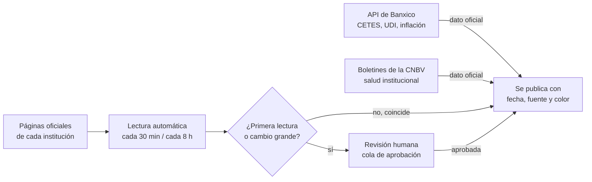
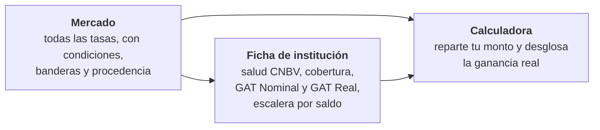

# Centinela Financiero

[](https://github.com/gibran-ojeda/brujula-financiera/actions/workflows/test.yml)

Comparador informativo de instrumentos de ahorro en México — CETES, SOFIPOs y
bancos digitales — que muestra **la tasa tal como la publica cada
institución**, con sus condiciones, la procedencia de cada dato y señales de
salud de quien la ofrece.

**En producción: <https://centinelafinanciero.lat>**

No es asesoría de inversión, no recibe dinero, no intermedia contrataciones y
no cobra a las instituciones listadas.

## Qué resuelve

Una tasa anunciada no es lo que acabas ganando. Entre el anuncio y tu bolsillo
están la letra pequeña (montos, membresías, promociones), la retención de ISR,
la inflación y —si la institución quiebra— el límite del seguro de depósito.
Centinela pone todo eso junto y a la vista, con los mismos datos que publican
las instituciones, Banxico y la CNBV.

## De dónde sale cada número

La regla de origen del proyecto: un número publicado sale de **quien lo ofrece
o de quien lo regula** — nunca de otro comparador. Y nada de lo que lee una
máquina se publica solo: la primera lectura de cada producto, y cualquier
cambio fuera de tolerancia, los aprueba una persona.



- **API de Banxico** — deuda gubernamental, UDI e inflación, a diario.
- **Boletines de la CNBV** — indicadores de salud de cada institución, con la
  cadencia mensual de la propia CNBV.
- **Páginas oficiales** — las tasas de SOFIPOs y bancos digitales se leen de
  la página de cada institución: cada 30 minutos las de texto plano, cada 8
  horas las que necesitan un navegador para renderizar.

Las lecturas heredadas de agregadores se publican etiquetadas **«sin
verificar»** hasta que la lectura oficial de cada producto las sustituye.

## Cómo leer el sitio

La fecha de cada tasa lleva un color, y el color es la procedencia:

| Fecha | Qué significa |
|---|---|
| 🟢 **Verde** | Verificada contra la fuente oficial |
| 🔵 **Azul** | Capturada a mano de la publicación de la institución |
| 🟡 **Ámbar** | Leída de un agregador de terceros, aún **sin verificar** |

Junto a cada tasa van sus **condiciones** en etiquetas —los tramos por saldo
(«15.00 % hasta $25 mil») y la letra pequeña que la condiciona— y las
**banderas**, amarillas o rojas, cuando los datos públicos de la CNBV muestran
algo que conviene mirar. Una bandera es señal, no dictamen.



## Los conceptos que sí hay que conocer

- **GAT Nominal y GAT Real** — la Ganancia Anual Total que la regulación
  mexicana obliga a revelar, antes de impuestos; la Real descuenta la
  inflación esperada. Viven en la ficha de cada institución.
- **TEN (tasa efectiva neta)** — lo que queda después de la retención de ISR.
  Vive en la calculadora, que es donde se responde «¿cuánto gano de verdad?».
- **Cobertura (IPAB / PROSOFIPO)** — el seguro que responde por tu depósito si
  la institución quiebra, con su límite convertido a pesos al valor de la UDI.
- **Ganancia real** — bruto − ISR − inflación. La calculadora la desglosa paso
  a paso y, si repartes entre varias instituciones, respeta el límite de
  seguro de cada una.

## Lo que NO es

- No recomienda dónde invertir: describe y compara; la decisión es tuya.
- No intermedia: no hay botón de contratar, ni comisiones, ni afiliados.
- Las banderas no son dictámenes de solvencia: son señales calculadas con
  datos públicos, con su periodo y su fuente a la vista.

## Levántalo

```bash
cp .env.example .env   # y pon una POSTGRES_PASSWORD
docker compose up -d --build
docker compose exec api python -m cli seed
docker compose exec api python -m cli tasas import seeds/tasas.csv
```

El sitio queda en `http://127.0.0.1:8011` y la API en `http://127.0.0.1:8010`
(`/docs` para el contrato). Para desarrollar —entorno, suite, estilo y las
reglas de datos que ningún PR puede romper— está
[CONTRIBUTING.md](CONTRIBUTING.md).

## Documentación

- [`foundation-comparador-financiero-mx.md`](foundation-comparador-financiero-mx.md)
  — el documento de producto: qué se compara, cómo se calcula cada métrica y
  qué reglas rigen las banderas
- [`docs/`](docs/) — despliegue, runbook operativo y los criterios de
  redacción de lo que el sitio afirma

La convivencia se rige por el [Código de Conducta](CODE_OF_CONDUCT.md); las
vulnerabilidades van por el canal privado de [SECURITY.md](SECURITY.md).

## Licencia

MIT © 2026 Gibran Ojeda. Los datos pertenecen a sus fuentes; este proyecto los
recopila, calcula sobre ellos y los atribuye.
