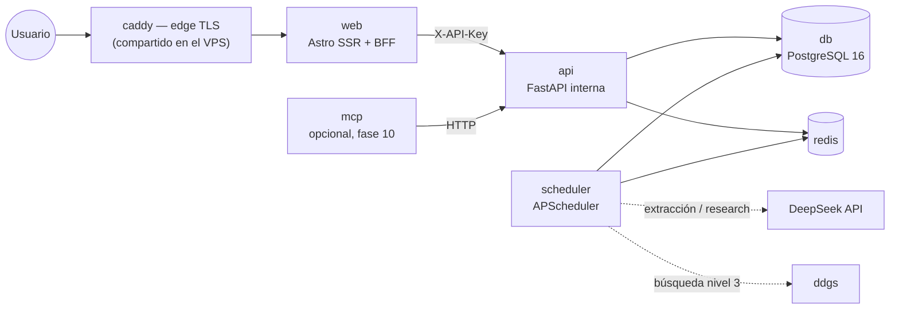

# Centinela Financiero
## Foundation: Comparador de Herramientas Financieras en México

> Documento de definición conceptual y de producto para una plataforma centralizada de comparación de instrumentos financieros en México.

**Nombre del proyecto:** Centinela Financiero
**Tagline provisional:** *Vigila lo que de verdad ganas.*

---

## 1. Problema Central

El ahorrador e inversionista mexicano —desde el perfil más conservador hasta el que ya diversifica— enfrenta un problema de **información fragmentada**:

- Los rendimientos de CETES están en cetesdirecto.com
- Las tasas de SOFIPOs hay que buscarlas institución por institución
- Los bancos digitales publican sus tasas en sus propias apps o sitios
- Los bancos tradicionales raramente destacan sus tasas de ahorro
- No existe un lugar único, limpio y actualizado que ponga todo junto

El resultado: decisiones financieras tomadas con información incompleta, comparaciones imposibles o basadas en datos desactualizados.

---

## 2. Propuesta de Valor

Una plataforma centralizada que permita comparar **en una sola pantalla** los instrumentos financieros más relevantes para el mercado mexicano, mostrando **los números que importan** —tasas, plazos, GATs, cobertura de seguro— sin ruido.

**Principios:**
- Datos actualizados (no estáticos)
- Comparación justa (misma métrica para todos)
- Sin sesgos comerciales ni publicidad
- Accesible para cualquier nivel de educación financiera

---

## 3. Instrumentos a Cubrir

> **Principio de clasificación:** Cada institución se clasifica según su figura regulatoria vigente, no por cómo se percibe en el mercado. El estatus regulatorio determina la cobertura de seguro aplicable, los indicadores de salud relevantes y las métricas comparables. No se mezclan figuras jurídicas distintas dentro de una misma categoría.

---

### 3.1 Gubernamentales (Banxico / SHCP)

Deuda emitida o respaldada directamente por el Gobierno Federal Mexicano. Sin límite de cobertura — el riesgo de contraparte es el riesgo soberano del país.

| Instrumento | Descripción | Plazo típico | Referencia |
|---|---|---|---|
| **CETES** | Certificados de la Tesorería de la Federación. Deuda soberana a descuento. | 28, 91, 182, 364 días | cetesdirecto.com / subastas Banxico |
| **BONDES D** | Bonos de Desarrollo con tasa flotante referenciada a TIIE | 1, 3, 5 años | Banxico |
| **BONOS M** | Bonos gubernamentales a tasa fija de largo plazo | 3, 5, 10, 20, 30 años | Banxico |
| **UDIBONOS** | Bonos indizados a inflación (UDIs) | 3, 10, 30 años | Banxico |
| **BONDDIA** | Fondo de dinero gubernamental con rendimiento diario | Diario / a la vista | cetesdirecto.com |

> **Dato clave a mostrar:** Tasa anual vigente (última subasta), tasa efectiva neta (descontando ISR), plazo mínimo.

---

### 3.2 SOFIPOs — Sociedades Financieras Populares
**Regulador:** CNBV | **Seguro de depósito:** PROSOFIPO (hasta 25,000 UDIs ≈ $220,000 MXN por persona por institución)

Entidades de ahorro popular reguladas por la CNBV. Ofrecen tasas superiores a la banca tradicional, pero con menor cobertura de seguro que los bancos. Están obligadas a publicar la GAT de sus productos de captación, y la CNBV les asigna un NICAP (nivel de capitalización) como categoría prudencial.

**Datos clave:**
- Tasa nominal anual por plazo
- **GAT Nominal y GAT Real** — métrica regulada que refleja el rendimiento real después de comisiones (ver sección 4.3)
- Cobertura PROSOFIPO vigente
- Monto mínimo, tipo de producto (a la vista / plazo fijo), penalización por retiro anticipado
- Indicadores de salud: IMOR, ICAP, NICAP, cobertura de cartera vencida (ver sección 5)

**Instituciones (SOFIPO con operación activa):**
DiDi, FinSUS, Kubo Financiero, Libertad, Caja Pop Mexicana, Te Creemos, entre otras.

> Nu México operó como SOFIPO hasta abril 2025, cuando recibió autorización de la CNBV para convertirse en banco. Ya no aplica en esta categoría.

---

### 3.3 Bancos de Reciente Creación (Neobancos con Licencia Bancaria Múltiple)
**Regulador:** CNBV | **Seguro de depósito:** IPAB (hasta 400,000 UDIs ≈ $3.5M MXN por persona por institución)

Instituciones que operan 100% digital o con infraestructura ligera, con licencia de banca múltiple otorgada por la CNBV. Tienen la misma cobertura IPAB que la banca tradicional. Se clasifican separado porque su modelo de negocio, estructura de costos y perfil de riesgo difieren de la banca establecida.

**Datos clave:**
- Tasa nominal anual en cuenta de ahorro / producto de captación
- Tasa efectiva neta y GAT (publicada o equivalente calculado)
- Cobertura IPAB confirmada
- Monto mínimo, liquidez

**Instituciones (licencia bancaria múltiple activa o en inicio de operaciones a 2026):**

| Institución | Origen / Grupo | Estatus |
|---|---|---|
| **Nu México** | Nubank (Brasil) | Licencia bancaria otorgada abril 2025; **operando como banco desde 2026** con cobertura IPAB. Buena parte del mercado —incluidos comparadores como tasas.mx— la sigue listando como SOFIPO y le atribuye cobertura PROSOFIPO de ~$220 mil en vez de los ~$3.5M del IPAB |
| **Revolut** | Revolut (Reino Unido) | Licencia CNBV otorgada oct. 2025; fase beta nov. 2025, lanzamiento masivo 2026 |
| **Uala** | Uala (Argentina) | Licencia bancaria activa en México |
| **OpenBank** | Grupo Santander | Brazo digital de Santander; opera desde feb. 2025 con licencia bancaria |
| **Hey Banco** | Banregio | Banco digital del grupo Banregio; licencia bancaria múltiple |
| **Bineo** | Banorte | Banco digital de Banorte; licencia bancaria múltiple |
| **Plata** | Plata Card | Licencia bancaria activa |

> **Instituciones en proceso (sin licencia bancaria activa aún):** Mercado Pago opera actualmente como IFPE (Institución de Fondos de Pago Electrónico), regulada por CNBV — su solicitud de licencia bancaria está en trámite. Klar también en proceso. Estas instituciones no se incluyen en esta categoría hasta obtener licencia bancaria múltiple.

---

### 3.4 Bancos Tradicionales (Banca Múltiple Establecida)
**Regulador:** CNBV | **Seguro de depósito:** IPAB (hasta 400,000 UDIs ≈ $3.5M MXN por persona por institución)

La banca establecida con presencia física y digital. Suele ofrecer tasas de ahorro más bajas, pero productos como el **PRLV (Pagaré con Rendimiento Liquidable al Vencimiento)** pueden ser competitivos a ciertos plazos.

**Datos clave:**
- Tasa en cuenta de ahorro / nómina
- Tasa en PRLV por plazo (28, 91, 182, 364 días)
- Cobertura IPAB
- Monto mínimo para tasa preferencial

**Instituciones relevantes:**
BBVA, Banorte, Santander, HSBC, Citibanamex, Scotiabank, Inbursa, BanBajío, entre otros.

---

### 3.5 IFPEs — Instituciones de Fondos de Pago Electrónico
**Regulador:** CNBV (Ley Fintech) | **Seguro de depósito:** Sin cobertura IPAB ni PROSOFIPO

Figura regulatoria creada por la Ley Fintech (2018). Pueden recibir y administrar fondos electrónicos, pero **no son bancos ni SOFIPOs**. Sus depósitos no están cubiertos por IPAB ni PROSOFIPO — los recursos deben mantenerse en fideicomiso o en cuentas separadas conforme a la ley, pero el usuario no tiene la misma protección institucional.

Se incluyen en la plataforma solo si ofrecen un producto de rendimiento explícito y regulado. Su clasificación debe ser visible y diferenciada.

**Datos clave adicionales a mostrar:**
- Esquema de resguardo de fondos (fideicomiso / cuentas segregadas)
- Ausencia de cobertura IPAB/PROSOFIPO — **bandera informativa permanente**, no de alerta, sino de contexto

**Instituciones relevantes (IFPE activa con producto de rendimiento):**
Mercado Pago (en proceso de licencia bancaria), Spin by OXXO, entre otras.

> En cuanto Mercado Pago u otra IFPE obtenga licencia bancaria múltiple, se migra automáticamente a la categoría 3.3.

---

## 4. Métricas Clave (Los Números que Importan)

El corazón de la plataforma es mostrar comparaciones justas. Para lograrlo, se necesita **homologar** las métricas entre instrumentos que no tienen la misma estructura.

> **Principio rector:** Mostrar pocos números, los correctos. La vista principal muestra solo tasa, plazo y tipo de instrumento. El detalle de salud financiera de la institución queda un nivel más abajo, comunicado mediante un sistema de banderas.

### 4.1 Tasa Nominal Anual (TNA)
La tasa base publicada por la institución antes de impuestos. Punto de partida para comparar, pero **nunca el número final** que se le muestra al usuario como referencia de ganancia.

### 4.2 Tasa Efectiva Neta (TEN) — después de impuestos
TNA descontando el tratamiento fiscal correspondiente **por tipo de instrumento**, ya que no todos tributan igual:

| Instrumento | Tratamiento ISR (persona física residente) |
|---|---|
| CETES / BONOS / BONDDIA | Retención del **0.90% anual sobre el capital** (tasa sobre capital, no sobre rendimiento) |
| PRLV bancario | Retención del **0.90% anual sobre el capital** |
| SOFIPOs | Retención del **0.90% anual sobre el capital** |
| Fondos de inversión de deuda | Retención del **0.90% anual sobre el capital**, igual que el resto — no sobre la ganancia |
| UDIBONOS | La ganancia por inflación (ajuste UDI) no causa ISR hasta el vencimiento en algunos esquemas |

**Tasa vigente: 0.90% anual.** La fija el art. 24 de la Ley de Ingresos de la
Federación para 2026, publicada en el DOF el 7 de noviembre de 2025 y vigente
desde el 1 de enero de 2026. Sustituye al 0.50% del ejercicio 2025 — un
aumento del 80% que resta unos 0.4 puntos a la TEN de todo instrumento de
deuda. La tasa cambia por decreto cada ejercicio, así que se almacena como
parámetro fechado (`parametros_fiscales`) y no como constante.

**Base de prorrateo: 360 días, no 365.** La regla de la Resolución Miscelánea
Fiscal expresa la retención diaria como `0.00139% × días`, que es exactamente
`0.50% / 360` con la tasa del ejercicio anterior. La base de día comercial es
la que reproduce las cifras que efectivamente retienen las instituciones.

**Los fondos de deuda retienen sobre capital, no sobre ganancia.** El art. 87
de la LISR releva al fondo de la obligación de retener y remite al régimen del
art. 54, que es el mismo de capital que aplica a los demás instrumentos. La
distinción que hacía la versión anterior de esta tabla no existe en la ley.

> La retención es **provisional y acreditable**: no es el impuesto final. En la
> declaración anual se acredita contra el ISR que resulte de los intereses
> reales. La plataforma muestra la retención porque es lo que el usuario ve
> descontado en su estado de cuenta, y lo dice con esas palabras.

La TEN es la métrica principal de comparación. Permite que el usuario vea cuánto **realmente se queda en su bolsillo** por cada instrumento.

### 4.3 GAT Nominal y GAT Real (métrica regulada)
La **Ganancia Anual Total (GAT)** es la métrica regulada por Banxico que expresa el rendimiento anual de un producto de captación considerando la tasa de interés y todos los costos asociados. Es el equivalente al CAT del crédito pero para el lado del ahorro, y las instituciones de captación (bancos y SOFIPOs) están obligadas a publicarla en dos variantes:

- **GAT Nominal** — rendimiento anual total antes de inflación
- **GAT Real** — rendimiento anual total descontando la inflación esperada

**Dato obligatorio a mostrar** cuando la institución lo publica. La GAT es la métrica homologada natural del comparador: ya existe, es comparable entre instituciones y está respaldada por regulación — no hay que inventarla, hay que centralizarla.

> **Nota de corrección:** versiones anteriores de este documento llamaban "NICAP" a esta métrica. El NICAP real (Nivel de Capitalización) es una categoría prudencial de solvencia de las SOFIPOs, no una métrica de rendimiento; se trata en la sección 5.1.

### 4.4 Equivalente GAT calculado para otros instrumentos
Para instrumentos que no publican GAT (deuda gubernamental comprada en directo, IFPEs, o productos donde la institución no la muestre de forma visible), calcular y mostrar la **tasa efectiva comparable** siguiendo la misma lógica: rendimiento anual real después de retenciones y comisiones. Esto permite que cualquier instrumento pueda colocarse en la misma columna de comparación, sin que el usuario necesite conocer las diferencias técnicas entre categorías.

### 4.5 Ganancia Real después de Inflación
El número más honesto que se le puede mostrar a un usuario:

```
Ganancia Real = Monto invertido × TEN − (Monto invertido × Inflación INPC anual vigente)
```

Ejemplo con $100,000 MXN a un año:
- CETE al 7.5% nominal → TEN = **6.60%** → Ganancia neta: **$6,600**
  (bruto $7,500 − ISR $900, que es el 0.90% del capital)
- Inflación INPC: 4.5% → **$4,500**
- **Ganancia real: $2,100** (lo que realmente creció el poder adquisitivo)

Este cálculo debe estar disponible en la calculadora y mostrarse visualmente de forma clara: cuánto ganas, cuánto se va a impuestos, cuánto "se come" la inflación.

### 4.6 Cobertura de Seguro

La cobertura depende de la figura regulatoria de la institución, no de cómo se llame o cómo se perciba en el mercado. Este dato debe mostrarse siempre junto a la tasa — nunca en letra chica.

| Categoría | Figura regulatoria | Fondo protector | Límite aprox. |
|---|---|---|---|
| Gubernamental | Gobierno Federal / Banxico | Gobierno Federal | Sin límite (deuda soberana) |
| SOFIPO | Soc. Financiera Popular — CNBV | PROSOFIPO | ~$220,000 MXN (25,000 UDIs) |
| Banco (tradicional o neobanco) | Banca Múltiple — CNBV | IPAB | ~$3.5M MXN (400,000 UDIs) |
| IFPE | Inst. de Fondos de Pago Electrónico — CNBV | Sin cobertura IPAB/PROSOFIPO | Fondos en fideicomiso segregado |

---

## 5. Sistema de Banderas de Riesgo Institucional

> **Filosofía:** La vista principal muestra tasas, plazos y tipo de instrumento. El fondo de salud institucional no se muestra por defecto — existe como capa de detalle para quien quiera profundizar. Sin embargo, cuando los indicadores superan umbrales de alerta, **se muestra una bandera visible junto al nombre de la institución**, sin necesidad de que el usuario entre al detalle.

Las banderas no califican el instrumento financiero en sí, sino la **salud de la institución que lo respalda**.

---

### 5.1 Indicadores de Salud para SOFIPOs y Bancos

Estas instituciones emiten créditos (están en el negocio de prestar dinero). Por eso, la salud de su cartera afecta directamente la seguridad de los depósitos que captan.

#### Índice de Morosidad (IMOR)
Porcentaje de la cartera de crédito que está en mora (pagos vencidos). Fuente: CNBV.

| Nivel | Umbral orientativo | Bandera |
|---|---|---|
| Sano | < 3% | — (sin bandera) |
| Atención | 3% – 6% | 🟡 Amarilla |
| Alerta | > 6% | 🔴 Roja |

> Un IMOR alto significa que la institución tiene problemas para cobrar lo que prestó. Eso presiona su liquidez y su capital.

#### Índice de Cobertura de Cartera Vencida
Mide si la institución tiene suficientes reservas para absorber su cartera en mora. Un índice menor a 1x significa que no tiene reservas suficientes para cubrir lo que ya está vencido.

| Nivel | Umbral orientativo | Bandera |
|---|---|---|
| Adecuado | > 100% (1x) | — |
| Atención | 70% – 100% | 🟡 Amarilla |
| Alerta | < 70% | 🔴 Roja |

#### Índice de Capitalización (ICAP)
Porcentaje del capital propio de la institución respecto a sus activos ponderados por riesgo. Regulatoriamente, las SOFIPOs deben mantener un ICAP mínimo del 10.5%. Un ICAP bajo con IMOR alto es la combinación más peligrosa.

| Nivel | Umbral orientativo | Bandera |
|---|---|---|
| Sano | > 15% | — |
| Atención | 10.5% – 15% | 🟡 Amarilla |
| Alerta | < 10.5% (por debajo del mínimo regulatorio) | 🔴 Roja |

#### NICAP — Nivel de Capitalización (SOFIPOs)
Categoría prudencial oficial que la CNBV asigna a cada SOFIPO en función de su ICAP respecto al requerimiento mínimo de capital. Es el indicador sintético de solvencia de la figura SOFIPO — **no es una métrica de rendimiento** (ver nota en sección 4.3).

| Nivel | Situación | Bandera |
|---|---|---|
| N1 | Capital por encima del requerimiento, con holgura | — (sin bandera) |
| N2 | Cumple el requerimiento sin holgura | 🟡 Amarilla |
| N3 / N4 | Por debajo del requerimiento — sujeta a medidas correctivas o intervención | 🔴 Roja |

> Fuente: CNBV. El NICAP se publica con rezago; la plataforma muestra siempre el periodo de referencia del dato.

#### Nivel de Apalancamiento / Endeudamiento
Una institución puede tener una tasa atractiva porque está sobrecapitalizada en pasivos (debe mucho más de lo que tiene). El ratio Pasivo / Capital da señal de qué tan apalancada está.

| Situación | Señal |
|---|---|
| Institución capta muchos depósitos pero su cartera de crédito tiene IMOR alto | 🔴 Roja — no tiene cómo recuperar lo que presta, pero sigue captando |
| Institución crece agresivamente en captación sin crecer en capital | 🟡 Amarilla |

---

### 5.2 Combinaciones Críticas (Banderas Compuestas)

Algunas combinaciones de indicadores son más peligrosas que cualquier indicador individual:

| Combinación | Bandera compuesta |
|---|---|
| IMOR alto + ICAP bajo + crecimiento agresivo en captación | 🔴 **No recomendable** — la institución capta para pagar deudas previas |
| Tasa muy por encima del mercado + IMOR en alerta | 🔴 **Red flag** — la tasa alta puede ser señal de desesperación por liquidez |
| GAT inconsistente con tasa nominal publicada (diferencia > 1.5pp) | 🟡 Revisar — puede haber comisiones ocultas o condiciones restrictivas |

> **Nota de diseño:** Las banderas compuestas tienen prioridad visual sobre las individuales. Si hay una 🔴 compuesta, no se muestra también la 🟡 individual — se muestra solo la más severa, con enlace al detalle.

---

### 5.3 Instrumentos Gubernamentales y Banderas

CETES, BONOS M, UDIBONOS y BONDDIA son deuda del Gobierno Federal Mexicano. No aplica el mismo análisis de morosidad o capitalización. La única "bandera" relevante aquí sería un deterioro en la calificación soberana de México (Moody's, S&P, Fitch), lo cual es un evento de baja probabilidad pero relevante en horizontes largos.

Para bancos digitales sin licencia bancaria plena (esquemas de "e-money" o fondeo en fideicomiso), la bandera principal es la **ausencia de cobertura IPAB**, lo cual ya se refleja en la sección 4.6.

---

## 6. Calculadora de Rendimiento Real

La calculadora no es un extra — es una de las herramientas centrales de la plataforma. Su función: mostrar la ganancia real después de impuestos e inflación, de forma visual y sin tecnicismos.

**Inputs del usuario:**
- Monto a invertir (MXN)
- Plazo deseado
- Instrumento o institución (o comparar varios)

**Outputs calculados:**
1. **Rendimiento bruto** — lo que dice la tasa nominal
2. **ISR retenido** — cuánto se va al fisco (calculado según el tipo de instrumento)
3. **Rendimiento neto** — lo que realmente recibes
4. **Efecto inflación** — cuánto "se come" el INPC en ese período
5. **Ganancia real** — el número final: cuánto creció tu poder adquisitivo

> La calculadora debe mostrar estos 5 conceptos visualmente en cascada, no como tabla. El usuario debe ver claramente que "de $1,000 de ganancia bruta, $120 son impuestos, $600 son inflación, y $280 son ganancia real tuya."
>
> Esas proporciones salen del mismo escenario de §4.5 (7.5% nominal, 4.5% de
> inflación) escalado a $1,000 de rendimiento bruto. Con la retención de 2025
> la ganancia real de ese escenario era del 50% del bruto; con la de 2026 es
> del 28%. La cascada existe justamente para que ese cambio se vea.

**Nota fiscal importante:** El tratamiento de impuestos varía por instrumento (ver sección 4.2). La calculadora debe aplicar el correcto automáticamente según el instrumento seleccionado, y mostrar una nota breve de qué tasa de retención se está usando y cuándo fue actualizada.

---

## 7. Criterios de Filtrado y Búsqueda

Para que la plataforma sea verdaderamente útil, el usuario debe poder filtrar por:

- **Plazo** (a la vista, 28d, 91d, 182d, 1 año, más de 1 año)
- **Tipo de instrumento** (Gubernamental / SOFIPO / Banco digital / Banco tradicional)
- **Monto a invertir** (para mostrar solo opciones accesibles con ese capital)
- **Nivel de riesgo / cobertura** (solo IPAB / solo Gobierno / todos)
- **Liquidez** (retiro inmediato vs. plazo fijo)
- **Mostrar solo sin banderas** (filtrar instituciones con alertas activas)
- **Ordenar por:** tasa nominal / tasa efectiva / GAT / cobertura

---

## 8. Gaps del Mercado Actual

Las herramientas existentes (Tasas.mx, InvesTrack, Trimsy, CONDUSEF) **no resuelven** completamente:

| Gap | Descripción |
|---|---|
| **Cobertura incompleta** | Ninguna incluye BONOS M, UDIBONOS y BONDES D junto a SOFIPOs y bancos |
| **GAT centralizada** | Solo Trimsy muestra la GAT; los demás usan tasa nominal |
| **Equivalencia entre instrumentos** | No hay una métrica homologada que permita comparar un CETE vs. una SOFIPO vs. un banco digital en igualdad de condiciones |
| **Bancos tradicionales** | Los comparadores no incluyen sistemáticamente PRLV de banca tradicional |
| **Tasa real vs. inflación** | Ninguno muestra rendimiento real (descontando INPC) de forma prominente |
| **Ganancia neta después de ISR** | La mayoría muestra tasas brutas; el tratamiento fiscal por instrumento nunca se calcula automáticamente |
| **Salud institucional visible** | Nadie muestra IMOR, ICAP ni señales de alerta junto a las tasas |
| **Monto mínimo como filtro** | Pocas herramientas permiten filtrar por capital disponible |
| **Transparencia de riesgo** | La diferencia entre IPAB y PROSOFIPO raramente se explica en el mismo lugar que las tasas |
| **Datos en tiempo real** | La mayoría actualiza manualmente o con baja frecuencia |

---

## 9. Usuarios Objetivo

| Perfil | Necesidad principal |
|---|---|
| **Ahorrador básico** | Saber dónde poner su dinero para ganar más sin riesgo, ver la ganancia real en pesos |
| **Inversionista conservador** | Comparar instrumentos de bajo riesgo con liquidez razonable, descartar instituciones con banderas |
| **Inversionista activo** | Optimizar rendimientos por plazo, diversificar entre categorías, monitorear alertas |
| **Persona que descubrió SOFIPOs** | Entender qué es la GAT y si vale la pena el riesgo adicional vs. CETES |
| **Emprendedor / freelancer** | Gestionar liquidez con buenos rendimientos en instrumentos a corto plazo |

---

## 10. Lo que la Plataforma NO es

Para mantener el enfoque, definir explícitamente lo que queda fuera del alcance inicial:

- ❌ No es un broker ni permite invertir directamente desde la plataforma
- ❌ No incluye acciones, ETFs, fondos de inversión complejos ni criptomonedas
- ❌ No es un asesor financiero ni personaliza recomendaciones con responsabilidad legal
- ❌ No incluye seguros, créditos ni otros productos financieros
- ❌ No reemplaza revisar los contratos y condiciones de cada institución
- ❌ Las banderas de riesgo son señales orientativas, no dictámenes de solvencia

---

## 11. Principios de Diseño de Información

- **Claridad sobre completitud:** Mostrar tasa, plazo y tipo de instrumento. Todo lo demás es detalle bajo demanda.
- **Capas de profundidad:** Vista principal (tasas limpias) → banderas si aplica → detalle de salud institucional para quien quiera ir más fondo.
- **Comparación justa:** La misma métrica (tasa efectiva neta) para todos los instrumentos, no la más favorable para cada uno.
- **Contexto de riesgo visible sin ser alarmista:** Las banderas alertan; no descalifican por default. El usuario decide.
- **Actualización transparente:** Mostrar siempre la fecha de la última actualización de cada dato y de cada indicador de salud institucional.
- **Sin publicidad ni patrocinios que influyan en el ranking:** El orden responde solo a los datos.
- **Honestidad fiscal:** Nunca mostrar una tasa sin dejar claro si es bruta o neta de impuestos. Siempre aplicar el tratamiento correcto por instrumento.

---

## 12. Próximos Pasos (Roadmap Conceptual)

| Fase | Descripción | Plan de implementación |
|---|---|---|
| **Fase 1 – MVP** | CETES + BONDDIA + Top 10 SOFIPOs + Top 5 bancos digitales. Comparación por plazo. TEN calculada. Datos manuales actualizados semanalmente. | Fases [01](plan-de-implementacion/01-fase-1-scaffold-e-infraestructura.md)–[06](plan-de-implementacion/06-fase-6-despliegue-mvp.md) |
| **Fase 2 – Banderas** | Integrar IMOR, ICAP, NICAP y cobertura de cartera vencida por institución. Sistema de banderas 🟡🔴 visible en la vista principal. Fuente: reportes CNBV. | Fases [03](plan-de-implementacion/03-fase-3-motor-de-metricas.md) y [08](plan-de-implementacion/08-fase-8-ingesta-cnbv-y-banderas.md) |
| **Fase 3 – Calculadora** | Calculadora de ganancia real con desglose: bruto → ISR → inflación → neto. Tratamiento fiscal correcto por instrumento. | Fases [03](plan-de-implementacion/03-fase-3-motor-de-metricas.md), [04](plan-de-implementacion/04-fase-4-api-publica.md) y [05](plan-de-implementacion/05-fase-5-frontend-mvp.md) |
| **Fase 4 – Datos vivos** | Integración con fuentes oficiales (Banxico API, cetesdirecto, CNBV) para actualización automática de tasas y datos de salud institucional. | Fases [07](plan-de-implementacion/07-fase-7-ingesta-banxico.md), [08](plan-de-implementacion/08-fase-8-ingesta-cnbv-y-banderas.md) y [09](plan-de-implementacion/09-fase-9-agente-llm-de-tasas.md) |
| **Fase 5 – Cobertura completa** | Agregar BONOS M, UDIBONOS, BONDES D, bancos tradicionales con PRLV. | Fase [10](plan-de-implementacion/10-fase-10-extensiones.md) |
| **Fase 6 – Contexto avanzado** | Histórico de tasas, tendencia de IMOR por institución, alertas de cambio de tasa o de bandera, simulador de cartera diversificada. | Fase [10](plan-de-implementacion/10-fase-10-extensiones.md) |

> **Nota:** el orden ejecutable del plan difiere del roadmap conceptual. El motor de métricas (que habilita TEN y calculadora) se construye antes que la API y el frontend porque es prerequisito de ambos, y el MVP sale a producción con carga manual de datos **antes** de automatizar las ingestas. El razonamiento completo está en [`plan-de-implementacion/00-overview.md`](plan-de-implementacion/00-overview.md).

---

# Parte II — Fundación Técnica

> Esta parte define el stack, la arquitectura de servicios y la estrategia de obtención de datos con que se construye Centinela Financiero. La plantilla de referencia es el stack probado de NarrativeAlpha (Python 3.12 + FastAPI + PostgreSQL + Docker). El plan ejecutable, fase por fase, vive en [`plan-de-implementacion/`](plan-de-implementacion/00-overview.md).

---

## 13. Stack Tecnológico

| Capa | Tecnología | Justificación |
|---|---|---|
| Lenguaje | Python 3.12 | Ecosistema maduro para ETL, APIs async y LLM; mismo stack que NarrativeAlpha |
| Empaquetado | `pyproject.toml` único con extras por módulo (`api`, `scheduler`, `ingest`, `llm`, `browser`, `mcp`, `dev`) | Sin zoo de `requirements-*.txt`; cada imagen Docker instala solo lo que necesita |
| Layout | `src/` con paquetes planos; cada módulo ejecutable expone `__main__.py` (`python -m api`, `python -m scheduler`, `python -m cli`) | Servicios diferenciados solo por comando, una sola imagen |
| API | FastAPI + uvicorn, patrón *application factory* (`create_app()`) | Async nativo, OpenAPI automático, validación pydantic |
| Persistencia | PostgreSQL 16 + SQLAlchemy 2.0 async + asyncpg + Alembic | Migraciones versionadas; separación modelo de dominio (pydantic) / ORM |
| Cache y locks | Redis 7 — cache L2 de la vista comparador, locks distribuidos (`SET NX` + Lua) para jobs | Evita cómputo repetido y ejecuciones dobles del scheduler |
| Scheduler | APScheduler (`AsyncIOScheduler`) con registry declarativo de jobs | Sin Celery ni cron del sistema; jobs con `max_instances=1` + lock Redis |
| Configuración | **Dos capas**: `pydantic-settings` desde `.env` (infra y secretos) + **ConfigStore** en Postgres con versionado, hot-reload y proxy `effective` | Umbrales de banderas y parámetros fiscales ajustables **sin deploy** y con historial auditable |
| Observabilidad | structlog (JSON en prod, pretty en dev) + tabla `job_runs` | Trazabilidad de cada corrida de ingesta |
| LLM | Cliente router con tiers y fallback; `OpenAICompatProvider` con **DeepSeek** como primario; `CostTracker` con límite diario; prompts como plantillas `.md` externas; parsers JSON robustos | Costo mínimo, proveedor intercambiable vía `base_url`, gasto acotado |
| Frontend | **Astro SSR + islas React** (TanStack Query solo en calculadora y filtros) | Un comparador público vive del SEO; SSR para páginas indexables, interactividad como islas |
| Edge | Caddy 2 (TLS automático), **compartido con NarrativeAlpha** en el mismo VPS | El navegador solo llega al servicio `web`; la API interna nunca se expone |
| Contenedores | Docker Compose (proyecto `centinela`, aislado); imagen única `python:3.12-slim` diferenciada por `command` | Build una vez, deploy N servicios; cero colisión con el stack vecino |
| Calidad | pytest (`asyncio_mode=auto`) + respx + testcontainers; ruff + black + mypy strict; pre-commit; GitHub Actions | CI bloqueante en lint y tests |

**Doble gate por módulo** (patrón heredado de NarrativeAlpha): cada job de ingesta tiene un flag *env-only* que decide si se registra en el scheduler (ej. `SCHEDULER_BANXICO_ENABLED`) y un kill-switch *caliente* en ConfigStore que lo hace no-operar sin reiniciar (ej. `BANXICO_SYNC_ENABLED`).

---

## 14. Arquitectura de Servicios



| Servicio | Imagen | Expuesto | Función |
|---|---|---|---|
| `web` | node/astro | `127.0.0.1:8011` | SSR de páginas públicas + BFF; único que habla con el navegador |
| `api` | compartida | `127.0.0.1:8010` | FastAPI; única capa de acceso a datos; autenticación `X-API-Key` para el BFF y admin |
| `scheduler` | compartida | — | Jobs de ingesta, recomputo de banderas y frescura |
| `db` | `postgres:16` | `127.0.0.1:5433` | Datos + ConfigStore |
| `redis` | `redis:7-alpine` | `127.0.0.1:6380` | Cache L2, locks, cooldowns |
| `mcp` | compartida | opcional | FastMCP solo-lectura, cliente HTTP de la API (fase 10) |

**Patrón BFF:** el navegador solo habla con `web`; `web` consume la API por red interna inyectando `X-API-Key`. La API nunca se expone a internet.

**Co-hosting con NarrativeAlpha:** Centinela corre en el **mismo VPS** que NarrativeAlpha, como stack Docker independiente (proyecto `centinela`, base de datos, Redis e imagen propias — no se comparte estado). El **único recurso compartido es el Caddy del host**, que ya ocupa 80/443 en `network_mode: host`: Centinela no levanta su propio edge, se le añade un site block para `centinelafinanciero.lat` que apunta a `127.0.0.1:8011`. Todos los puertos de Centinela se publican solo en loopback y fuera del rango que NarrativeAlpha ya usa. El detalle operativo —incluida la restricción de `ufw` sobre el tráfico `docker0 → host`— está en la [fase 06 del plan](plan-de-implementacion/06-fase-6-despliegue-mvp.md).

---

## 15. Estrategia de Obtención de Datos

> **Doctrina: tres niveles, en orden estricto de preferencia.** Se descarta el scraping clásico por selectores CSS: mantener 20+ scrapers por institución es el peor punto de la curva costo/fragilidad — se rompen silenciosamente con cada rediseño. Nota sobre "búsqueda web de DeepSeek": la API de DeepSeek **no incluye búsqueda web nativa**; lo que sí permite —y es lo que se adopta— es el patrón de *tool-use* con ejecutor de búsqueda propio.

**Regla de origen, previa a los tres niveles.** Un número que se publica sale de **quien lo ofrece o de quien lo regula**: la institución en su propia página, la autoridad (SIE de Banxico, CNBV) o el emisor. Nada más.

Los agregadores —otros comparadores, la prensa financiera— **no son fuente publicable**. No por un impedimento legal, sino porque un comparador que republica lo que recopiló otro comparador no tiene fuente propia: no puede responder de un número que nadie de aquí leyó en su origen, no controla cuándo se actualiza, y hereda en silencio cualquier error ajeno. Sí tienen un uso legítimo y acotado: **contraste**. Un valor de agregador guardado con `FuenteTasa.AGREGADOR` es el término de comparación contra el que el reviewer mide la primera lectura oficial — que coincidan la respalda, y una discrepancia grande la manda a revisión humana. La invariante «AGREGADOR nunca VIGENTE» se hace cumplir en el punto de escritura, no filtrando al leer.

**Nivel 1 — API oficial y datos abiertos (determinista).** Todo lo gubernamental y macro sale del SIE de Banxico (token gratuito): subastas de CETES/BONDES/BONOS M/UDIBONOS, TIIE, valor UDI, INPC. Los indicadores de salud institucional (IMOR, ICAP, cobertura, NICAP) salen de los boletines mensuales del Portafolio de Información de la CNBV vía ETL de archivos CSV/XLSX. Aquí no se usa ni scraping ni LLM: sería pagar fragilidad y costo por datos que ya existen estructurados. Limitación aceptada: la CNBV publica con 1–3 meses de rezago; las banderas siempre indican su periodo de referencia.

**Nivel 2 — Fetch dirigido + extracción LLM (primario para tasas sin API).** Las tasas de SOFIPOs, neobancos, PRLV y BONDDIA no tienen API: se publican en la página oficial de cada institución. Se mantiene una lista curada de URLs (~15–25 páginas, tabla `fuentes_tasas`); un fetcher determinista (httpx + trafilatura; Playwright solo para las pocas que renderizan por JavaScript) descarga el contenido y un LLM económico (DeepSeek) extrae producto, tasa, GAT, plazo y condiciones como JSON validado contra esquema pydantic. La parte frágil (obtener la página) es determinista; la parte cambiante (el layout) la absorbe el LLM, que tolera rediseños que romperían cualquier selector CSS.

**Nivel 3 — Búsqueda abierta con agente LLM (descubrimiento y fallback).** Un *tool-use loop* donde el LLM formula queries y un ejecutor determinista las corre contra la librería `ddgs` (costo $0, sin API keys ni infraestructura), con retry → cadena de fallbacks entre engines → circuit breaker, e **invariante anti-alucinación**: todo hallazgo debe citar una URL surgida de resultados reales de búsqueda o se descarta. Se usa solo para descubrir instituciones nuevas, detectar cambios de URL y verificar valores anómalos del nivel 2 — nunca como fuente primaria rutinaria. El backend de búsqueda es intercambiable por configuración: si `ddgs` resulta insuficiente, puede apuntarse a un SearXNG autohospedado sin refactorizar.

**Control de calidad transversal:** ninguna tasa proveniente de LLM se publica automáticamente si difiere de la vigente más allá de una tolerancia configurable: entra a una cola de revisión humana (`revisiones_tasas`). Como las tasas cambian poco (ciclo semanal), la carga de revisión es de minutos por semana. Toda tasa publicada conserva URL fuente y fecha del dato. Costo estimado del pipeline LLM: centavos de USD por semana, acotado por el `CostTracker`.

| Dato | Fuente | Método | Frecuencia | Job |
|---|---|---|---|---|
| Subastas CETES/BONDES/BONOS M/UDIBONOS, TIIE, UDI, tipo de cambio, INPC | Banxico SIE API | Nivel 1: API oficial | Diaria | `banxico_sync_series` |
| IMOR, ICAP, NICAP, cobertura, captación | CNBV Portafolio de Información (CSV/XLSX) | Nivel 1: ETL | Mensual (rezago 1–3 meses) | `cnbv_boletines_mensual` |
| Rendimiento BONDDIA | cetesdirecto.com | Nivel 2: fetch dirigido + extracción LLM | Semanal | `tasas_fetch_dirigido` |
| Tasas/GAT de SOFIPOs, neobancos, PRLV, IFPEs | Sitios oficiales de cada institución | Nivel 2 primario; nivel 3 fallback; cola de revisión | Semanal | `tasas_fetch_dirigido` / `tasas_research_abierta` |
| Instituciones nuevas, cambios de URL, anomalías | Web abierta | Nivel 3: agente de investigación LLM | Semanal / bajo demanda | `tasas_research_abierta` |
| Verificación de frescura por fuente | interna | SLA por fuente | Diaria | `frescura_check` |

Cada fuente tiene un **SLA de frescura**; si se excede, `frescura_check` genera alerta y la UI muestra la fecha del dato en todo momento (obligación de la sección 11).

---

## 16. Modelo de Datos Conceptual

| Tabla | Contenido |
|---|---|
| `instituciones` | Catálogo: categoría (GOBIERNO / SOFIPO / BANCO_DIGITAL / BANCO_TRADICIONAL / IFPE), figura regulatoria, seguro (SOBERANO / IPAB / PROSOFIPO / NINGUNO), estatus, URL de tasas |
| `productos` | Producto de captación por institución: tipo (VISTA / PLAZO), plazo en días, monto mínimo, liquidez, penalización |
| `tasas` | **Append-only**: tasa nominal, GAT nominal, GAT real, fecha del dato, fuente (MANUAL / BANXICO_API / CNBV / FETCH_DIRIGIDO / LLM_RESEARCH), `fuente_url`, estado (VIGENTE / PENDIENTE_REVISION / RECHAZADA) |
| `indicadores_financieros` | Por institución y periodo: IMOR, ICAP, ICOR, NICAP, captación, cartera |
| `banderas` | Banderas activas e históricas: tipo, severidad, motivo, periodo del dato origen |
| `series_economicas` / `valores_serie` | Series macro de Banxico (UDI, INPC, TIIE, subastas) |
| `parametros_fiscales` | Retención ISR sobre capital por año (cambia por Ley de Ingresos), tratamiento por tipo de instrumento |
| `fuentes_tasas` | Lista curada de URLs por institución: nivel, `requiere_js`, activa |
| `revisiones_tasas` | Cola de revisión humana de extracciones LLM |
| `config_store` (+ versiones) | Parámetros de negocio con hot-reload: umbrales de banderas, tolerancias, flags |
| `job_runs` | Bitácora de cada corrida de job: inicio, fin, estado, métricas |

> **Nota de diseño:** los límites de seguro (IPAB 400,000 UDIs; PROSOFIPO 25,000 UDIs) se almacenan **en UDIs** y se convierten a MXN con el valor UDI vigente de la serie Banxico — nunca hardcodeados en pesos.

---

## 17. Estructura del Repositorio

```
centinela-financiero/
├── foundation-comparador-financiero-mx.md
├── plan-de-implementacion/        # este plan, fase por fase
├── pyproject.toml                 # único, con extras por módulo
├── docker-compose.yml
├── docker/                        # Dockerfiles (app, web) — el edge Caddy es compartido, ver §14
├── .github/workflows/             # CI (test.yml) y CD (deploy.yml)
├── prompts/                       # plantillas .md de LLM (extracción, research)
├── seeds/                         # instituciones.yaml, productos.yaml, tasas.csv
├── frontend/                      # Astro SSR + islas React
├── alembic/                       # migraciones
├── src/
│   ├── core/                      # settings, logging, db, redis, config_store
│   ├── domain/                    # modelos pydantic, enums, ORM SQLAlchemy
│   ├── metrics/                   # TEN, GAT, ganancia real, banderas (funciones puras)
│   ├── api/                       # FastAPI: routers públicos y admin
│   ├── scheduler/                 # runner, registry, locks, jobs/
│   ├── ingest_banxico/            # cliente SIE + catálogo de series
│   ├── ingest_cnbv/               # downloader + parsers de boletines
│   ├── rates_agent/               # fetcher, extractor, researcher, reviewer
│   ├── llm/                       # router, providers, cost_tracker, parsers
│   ├── cli/                       # seed, import de tasas, revisión
│   └── mcp_server/                # opcional (fase 10)
└── tests/                         # espejo de src/
```

---

## 18. Calidad, Pruebas y Despliegue

- **Tests:** pytest con `asyncio_mode=auto`; respx para mockear httpx (fixtures reales de Banxico/CNBV); testcontainers para tests con Postgres real; los ejemplos numéricos de la sección 4.5 son casos de test obligatorios del motor de métricas.
- **Estática:** ruff + black + mypy strict vía pre-commit.
- **CI (GitHub Actions):** lint bloqueante, mypy informativo, tests bloqueantes en cada PR.
- **CD:** push a `main` → SSH al VPS → `git reset --hard` + build + **gates duros**: migraciones Alembic aplicadas, verificación de deriva de esquema derivada del ORM (no de una lista a mano), smoke tests HTTP post-deploy y verificación de no-interferencia con el stack vecino. Rollback documentado.
- **Hosting:** despliegue íntegro en el VPS propio, sin PaaS de pago. El VPS ya está operando y el costo marginal de Centinela es ~$0.
- **Backups:** `pg_dump` programado con retención.

---

## 19. Cumplimiento y Transparencia Técnica

- La plataforma **no es asesor financiero** (sección 10): disclaimers presentes en la API (campo en cada respuesta de calculadora) y en el frontend.
- Toda tasa publicada conserva `fuente_url` y `fecha_dato` — auditable de punta a punta.
- Los umbrales de banderas viven en ConfigStore **versionado**: es reconstruible qué umbral estaba vigente cuándo y qué bandera generó.
- Las banderas se comunican como "señales orientativas basadas en datos públicos de la CNBV", nunca como dictámenes de solvencia. Revisión de redacción legal antes del lanzamiento público (fase 6).

---

*El plan ejecutable de esta fundación vive en [`plan-de-implementacion/`](plan-de-implementacion/00-overview.md).*

*Versión 1.5 — Correcciones fiscales verificadas contra fuente primaria durante la implementación de las fases 1–4: retención al **0.90%** (art. 24 LIF 2026, DOF 7-nov-2025), base de prorrateo de **360 días** (RMF), los fondos de deuda retienen **sobre capital** (art. 87 LISR → régimen del art. 54), y actualización del estatus de Nu México. Los ejemplos numéricos de §4.5 y §6 se recalcularon en consecuencia.*

*Versión 1.4 — Nombre de proyecto: **Centinela Financiero** (antes Brújula Financiera). Cambios: rebrand completo —nombre, tagline, identificadores de infraestructura y dominio propuesto—; la decisión D1 se divide y su parte de dominio queda reabierta (D1b).*

*Versión 1.3 — Corrección NICAP → GAT (secciones 3, 4, 5, 7 y 8) y Parte II: Fundación Técnica (secciones 13–19).*
