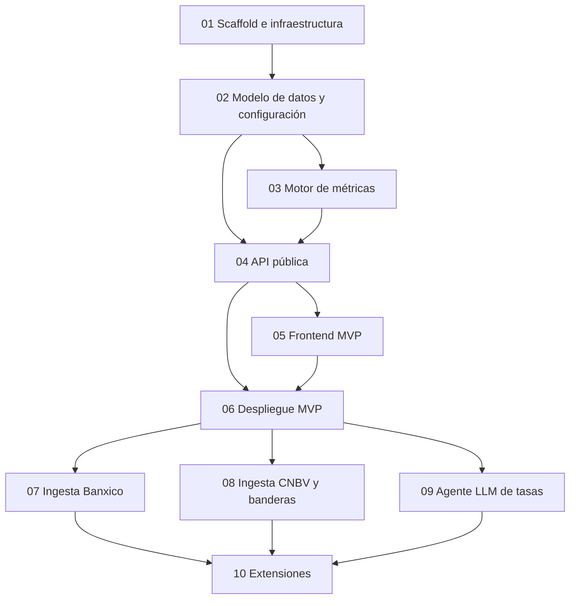

# Plan de implementación — Centinela Financiero

> Plan ejecutable de la [fundación](../foundation-comparador-financiero-mx.md) (v1.3). Diez fases incrementales: cada una deja el sistema en un estado funcional y verificable antes de pasar a la siguiente.

---

## Cómo leer este plan

- Cada fase es un archivo numerado (`01`–`10`) con cinco secciones fijas: **Objetivo, Entregables, Tareas, Criterios de aceptación, Dependencias**.
- **Definición de "hecho"** para toda fase: código escrito + tests en verde + criterios de aceptación verificados manualmente + CI verde. Una fase no se cierra "casi".
- Las fases 1–6 construyen y **despliegan el MVP con datos manuales** (Fase conceptual F1 del foundation). Las fases 7–9 automatizan las ingestas sobre un sistema ya vivo en producción. La fase 10 agrupa extensiones independientes.

## Mapa de fases y dependencias

**Por qué este orden y no el del roadmap conceptual (§12 del foundation):**

1. **El motor de métricas (03) va antes que la API (04):** TEN, GAT equivalente, ganancia real y banderas son lógica pura, unit-testeable sin infraestructura. Construirla primero da la base matemática verificada sobre la que todo lo demás solo "sirve datos".
2. **El despliegue (06) va antes que toda ingesta automática:** el foundation F1 pide explícitamente un MVP con datos manuales actualizados semanalmente. El producto sale a producción con carga manual vía CLI; las fases 7–9 automatizan sobre un sistema que ya opera, con usuarios y monitoreo reales.
3. **La ingesta LLM (09) va al final de las ingestas:** es la de mayor incertidumbre (calibración de prompts, cola de revisión). Cae sobre un pipeline maduro con las ingestas deterministas ya probadas.

## Mapeo al roadmap conceptual del foundation

| Fase conceptual (§12) | Fases de este plan |
|---|---|
| F1 – MVP | 01, 02, 03, 04, 05, 06 |
| F2 – Banderas | 03 (motor) + 08 (datos CNBV) |
| F3 – Calculadora | 03 (motor) + 04 (API) + 05 (UI) |
| F4 – Datos vivos | 07 (Banxico), 08 (CNBV), 09 (agente LLM) |
| F5 – Cobertura completa | 10 |
| F6 – Contexto avanzado | 10 |

## Convenciones transversales

- **Idioma:** código, identificadores y commits en **inglés**; documentación, UI y vocabulario de dominio financiero mexicano (GAT, NICAP, PRLV, SOFIPO) en **español**. Los nombres de tablas usan el término de dominio en español cuando es un concepto regulatorio mexicano sin traducción natural.
- **Monorepo:** backend (`src/`), frontend (`frontend/`), infraestructura (`docker/`), datos semilla (`seeds/`) y prompts (`prompts/`) viven en este repo.
- **Servicios Docker:** `web`, `api`, `scheduler`, `db`, `redis` y `mcp` (opcional, fase 10). El edge TLS (Caddy) es compartido con NarrativeAlpha y no forma parte de este stack — ver §14 del foundation y la fase 06.
- **Ramas:** trabajo en `feature/*`, PR a `main`; `main` siempre desplegable a partir de la fase 6.
- **Stack de referencia:** las decisiones de §13–§18 del foundation son vinculantes para todas las fases; los patrones (config de dos capas, doble gate de jobs, locks Redis, imagen Docker única) provienen de NarrativeAlpha y no se re-litigan por fase.

## Estrategia de datos (resumen operativo)

Tres niveles en orden estricto de preferencia — detalle completo en §15 del foundation:

1. **API oficial** (Banxico SIE, CNBV datos abiertos) → fases 07 y 08. Sin LLM ni scraping.
2. **Fetch dirigido + extracción LLM** (httpx/trafilatura + DeepSeek → JSON validado) → fase 09, primario para tasas sin API.
3. **Búsqueda abierta con agente LLM** (tool-use + `ddgs`, invariante `allowed_urls`) → fase 09, solo descubrimiento y verificación.

Se descarta el scraping clásico por selectores CSS. Toda tasa de origen LLM fuera de tolerancia pasa por cola de revisión humana antes de publicarse.

## Registro de decisiones abiertas

| # | Decisión | Estado | Afecta a |
|---|---|---|---|
| D1 | Hosting | **Resuelta** — **co-hosting en el VPS de NarrativeAlpha**, aislado en su propio stack Docker (proyecto `centinela`, contenedores y volúmenes con prefijo propio, puertos distintos). Sin PaaS de pago — todo en el VPS. Implicaciones en la fase 06 | 06 |
| D1b | Dominio | **Reabierta por el rebrand** — `brujulafinanciera.cloud` quedó obsoleto al renombrar el proyecto. Propuesto: **`centinelafinanciero.cloud`** (sin guion), pendiente de verificar disponibilidad y registrar. Bloquea el paso 2 de la fase 06 | 06 |
| D2 | API key de DeepSeek y límite diario del CostTracker | **Resuelta** — límite duro **$1 USD/día** (`LLM_COST_DAILY_LIMIT_USD=1.0`) | 09 |
| D3 | Alcance del seed inicial | **Resuelta** — catálogo **completo de F1**: top 10 SOFIPOs + top 5 neobancos + CETES + BONDDIA | 02 |
| D4 | Cola de revisión de tasas: ¿CLI o UI admin? | **Resuelta** — **CLI + endpoints admin** al inicio; mini-UI solo si el volumen de revisión lo justifica | 09 |
| D5 | Revisión de redacción legal de banderas y disclaimers antes del lanzamiento público | **Abierta** — bloqueante para cerrar la fase 6 (el resto de la fase puede avanzar) | 06 |
| D6 | Frontend | **Resuelta** — Astro SSR + islas React (SEO primero) | 05 |
| D7 | Nomenclatura de métrica de rendimiento | **Resuelta** — GAT (corrección aplicada al foundation v1.3); NICAP queda como indicador de salud | todas |

### Convivencia con NarrativeAlpha en el mismo VPS (consecuencia de D1)

Centinela **no comparte base de datos, Redis ni imagen** con NarrativeAlpha: son dos stacks Docker independientes en la misma máquina. Reglas que aplican a todas las fases:

- **Proyecto Docker propio**: `COMPOSE_PROJECT_NAME=centinela`; contenedores `centinela-*`, volúmenes `centinela-*`, red propia. Cero colisión de nombres con `narrativealpha-*`.
- **Puertos**: todo publicado **solo en `127.0.0.1`** y fuera del rango que ya ocupa NarrativeAlpha (5432, 6379, 8000, 8001, 8002, 8080 y 8899 del motor Vibe-Trading). Asignación de Centinela: `db` 5433, `redis` 6380, `api` 8010, `web` 8011.
- **Caddy es infraestructura compartida**: NarrativeAlpha ya corre el único Caddy del VPS en `network_mode: host` ocupando 80/443. Centinela **no levanta un Caddy propio** — se añade un site block al Caddyfile existente. Ver fase 06.
- **Sin `network_mode: host`** en los servicios de Centinela: el dashboard de NarrativeAlpha lo usa por el motor Vibe-Trading en `127.0.0.1:8899`, restricción que Centinela no tiene. Bridge con puertos publicados en loopback es suficiente y más limpio (Caddy en host mode los alcanza por `127.0.0.1`).
- **Cuidado con `ufw`**: en ese VPS el firewall dropea el tráfico `docker0 → host`, así que un contenedor de Centinela en bridge **no** alcanza servicios publicados en el loopback del host. Si Centinela necesitara consumir un servicio de NarrativeAlpha (p. ej. su SearXNG), la vía es adjuntar ese contenedor a la red bridge de NarrativeAlpha como red externa, no pasar por la gateway de Docker.

## Índice de fases

| Archivo | Fase |
|---|---|
| [01-fase-1-scaffold-e-infraestructura.md](01-fase-1-scaffold-e-infraestructura.md) | Scaffold e infraestructura |
| [02-fase-2-modelo-de-datos-y-configuracion.md](02-fase-2-modelo-de-datos-y-configuracion.md) | Modelo de datos y configuración |
| [03-fase-3-motor-de-metricas.md](03-fase-3-motor-de-metricas.md) | Motor de métricas |
| [04-fase-4-api-publica.md](04-fase-4-api-publica.md) | API pública |
| [05-fase-5-frontend-mvp.md](05-fase-5-frontend-mvp.md) | Frontend MVP |
| [06-fase-6-despliegue-mvp.md](06-fase-6-despliegue-mvp.md) | Despliegue del MVP |
| [07-fase-7-ingesta-banxico.md](07-fase-7-ingesta-banxico.md) | Ingesta Banxico (nivel 1) |
| [08-fase-8-ingesta-cnbv-y-banderas.md](08-fase-8-ingesta-cnbv-y-banderas.md) | Ingesta CNBV y banderas (nivel 1) |
| [09-fase-9-agente-llm-de-tasas.md](09-fase-9-agente-llm-de-tasas.md) | Agente LLM de tasas (niveles 2 y 3) |
| [10-fase-10-extensiones.md](10-fase-10-extensiones.md) | Extensiones |
