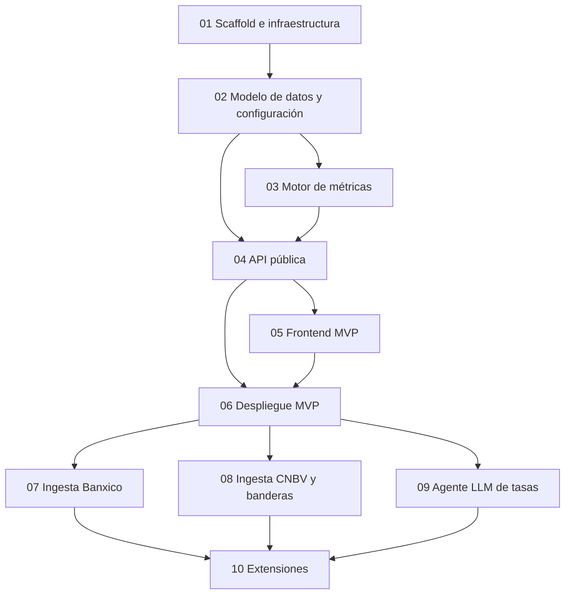

# Plan de implementación — Brújula Financiera

> Plan ejecutable de la [fundación](../foundation-comparador-financiero-mx.md) (v1.3). Diez fases incrementales: cada una deja el sistema en un estado funcional y verificable antes de pasar a la siguiente.

---

## Cómo leer este plan

- Cada fase es un archivo numerado (`01`–`10`) con cinco secciones fijas: **Objetivo, Entregables, Tareas, Criterios de aceptación, Dependencias**.
- **Definición de "hecho"** para toda fase: código escrito + tests en verde + criterios de aceptación verificados manualmente + CI verde. Una fase no se cierra "casi".
- Las fases 1–6 construyen y **despliegan el MVP con datos manuales** (Fase conceptual F1 del foundation). Las fases 7–9 automatizan las ingestas sobre un sistema ya vivo en producción. La fase 10 agrupa extensiones independientes.

## Mapa de fases y dependencias

**Por qué este orden y no el del roadmap conceptual (§12 del foundation):**

1. **El motor de métricas (03) va antes que la API (04):** TEN, GAT equivalente, ganancia real y banderas son lógica pura, unit-testeable sin infraestructura. Construirla primero da la base matemática verificada sobre la que todo lo demás solo "sirve datos".
2. **El despliegue (06) va antes que toda ingesta automática:** el foundation F1 pide explícitamente un MVP con datos manuales actualizados semanalmente. El producto sale a producción con carga manual vía CLI; las fases 7–9 automatizan sobre un sistema que ya opera, con usuarios y monitoreo reales.
3. **La ingesta LLM (09) va al final de las ingestas:** es la de mayor incertidumbre (calibración de prompts, cola de revisión). Cae sobre un pipeline maduro con las ingestas deterministas ya probadas.

## Mapeo al roadmap conceptual del foundation

| Fase conceptual (§12) | Fases de este plan |
|---|---|
| F1 – MVP | 01, 02, 03, 04, 05, 06 |
| F2 – Banderas | 03 (motor) + 08 (datos CNBV) |
| F3 – Calculadora | 03 (motor) + 04 (API) + 05 (UI) |
| F4 – Datos vivos | 07 (Banxico), 08 (CNBV), 09 (agente LLM) |
| F5 – Cobertura completa | 10 |
| F6 – Contexto avanzado | 10 |

## Convenciones transversales

- **Idioma:** código, identificadores y commits en **inglés**; documentación, UI y vocabulario de dominio financiero mexicano (GAT, NICAP, PRLV, SOFIPO) en **español**. Los nombres de tablas usan el término de dominio en español cuando es un concepto regulatorio mexicano sin traducción natural.
- **Monorepo:** backend (`src/`), frontend (`frontend/`), infraestructura (`docker/`), datos semilla (`seeds/`) y prompts (`prompts/`) viven en este repo.
- **Servicios Docker:** `caddy`, `web`, `api`, `scheduler`, `db`, `redis`, `searxng`, `mcp` (ver §14 del foundation).
- **Ramas:** trabajo en `feature/*`, PR a `main`; `main` siempre desplegable a partir de la fase 6.
- **Stack de referencia:** las decisiones de §13–§18 del foundation son vinculantes para todas las fases; los patrones (config de dos capas, doble gate de jobs, locks Redis, imagen Docker única) provienen de NarrativeAlpha y no se re-litigan por fase.

## Estrategia de datos (resumen operativo)

Tres niveles en orden estricto de preferencia — detalle completo en §15 del foundation:

1. **API oficial** (Banxico SIE, CNBV datos abiertos) → fases 07 y 08. Sin LLM ni scraping.
2. **Fetch dirigido + extracción LLM** (httpx/trafilatura + DeepSeek → JSON validado) → fase 09, primario para tasas sin API.
3. **Búsqueda abierta con agente LLM** (tool-use + SearXNG/ddgs, invariante `allowed_urls`) → fase 09, solo descubrimiento y verificación.

Se descarta el scraping clásico por selectores CSS. Toda tasa de origen LLM fuera de tolerancia pasa por cola de revisión humana antes de publicarse.

## Registro de decisiones abiertas

| # | Decisión | Estado | Afecta a |
|---|---|---|---|
| D1 | Dominio y hosting (¿VPS propio nuevo o compartir el de NarrativeAlpha? ¿brujulafinanciera.mx?) | **Abierta** — resolver antes de fase 6 | 06 |
| D2 | API key de DeepSeek y límite diario del CostTracker (sugerido: $1 USD/día) | **Abierta** — resolver antes de fase 9 | 09 |
| D3 | Alcance del seed inicial: arrancar con 5 SOFIPOs + 5 neobancos + CETES + BONDDIA y crecer, o los "top 10 + top 5" completos de F1 | **Abierta** — resolver en fase 2; sugerencia: arrancar con 5+5 | 02 |
| D4 | Cola de revisión de tasas: ¿basta CLI + endpoints admin, o mini-UI admin? | **Abierta** — CLI al inicio; UI si la carga lo justifica | 09 |
| D5 | Revisión de redacción legal de banderas y disclaimers antes del lanzamiento público | **Abierta** — obligatoria antes de cerrar fase 6 | 06 |
| D6 | Frontend | **Resuelta** — Astro SSR + islas React (SEO primero) | 05 |
| D7 | Nomenclatura de métrica de rendimiento | **Resuelta** — GAT (corrección aplicada al foundation v1.3); NICAP queda como indicador de salud | todas |

## Índice de fases

| Archivo | Fase |
|---|---|
| [01-fase-1-scaffold-e-infraestructura.md](01-fase-1-scaffold-e-infraestructura.md) | Scaffold e infraestructura |
| [02-fase-2-modelo-de-datos-y-configuracion.md](02-fase-2-modelo-de-datos-y-configuracion.md) | Modelo de datos y configuración |
| [03-fase-3-motor-de-metricas.md](03-fase-3-motor-de-metricas.md) | Motor de métricas |
| [04-fase-4-api-publica.md](04-fase-4-api-publica.md) | API pública |
| [05-fase-5-frontend-mvp.md](05-fase-5-frontend-mvp.md) | Frontend MVP |
| [06-fase-6-despliegue-mvp.md](06-fase-6-despliegue-mvp.md) | Despliegue del MVP |
| [07-fase-7-ingesta-banxico.md](07-fase-7-ingesta-banxico.md) | Ingesta Banxico (nivel 1) |
| [08-fase-8-ingesta-cnbv-y-banderas.md](08-fase-8-ingesta-cnbv-y-banderas.md) | Ingesta CNBV y banderas (nivel 1) |
| [09-fase-9-agente-llm-de-tasas.md](09-fase-9-agente-llm-de-tasas.md) | Agente LLM de tasas (niveles 2 y 3) |
| [10-fase-10-extensiones.md](10-fase-10-extensiones.md) | Extensiones |
